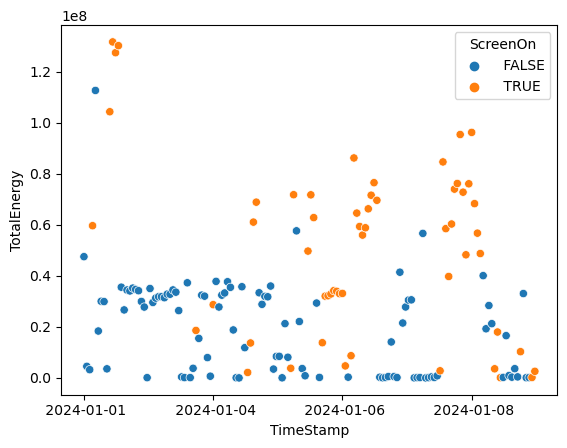

In this lab, I used the System Resource Usage Monitor Utility command on my Windows computer to generate a "battery report," which lists rudimentary data on energy usage per source of usage for each running program over time. On Windows, it is easy to acquire this data. Simply use the following command to generate the csv on the file path PATH:
~~~
powerpowercfg /srumutil /output PATH\srumutil.csv
~~~
This data interested me because I can use it to find out how much power I use while active, as well has how much energy I waste while idling or closing my computer (without shutting it off). Since I never shut my computer down (foolishly), I can see what impacts this has had on the world by using the mtCO2e conversion from [Measuring Your Application Power and Carbon Impact Part 1](https://devblogs.microsoft.com/sustainable-software/measuring-your-application-power-and-carbon-impact-part-1/) and my data given in mJ. Of course, this needs a point to it. 

I want to determine whether or not I should shut my computer down when I do not use it for long periods, determined purely from an environmental standpoint. Sure, it is a drag, but this data can tell me whether or not it is worth it using the mJ to mtCO2e (metric tons of carbon dioxide equivalent) conversion. 

In the lab, I primarily focused on the variables TimeStamp, the time the data was recorded, ScreenOn, whether the screen was on when data was collected, and TotalEnergyConsumption, the total energy consumed over a period given in mJ. TimeStamps were periodic, occurring about every hour, and the data was collected over the week before (1/1-1/8).

Overall, the data looks skewed left, towards the start of school. This makes sense as I did not use my computer as much during the break, as opposed to when I needed to use it for school and assignments. There also seems to be a very high peak near New Year's on the left side. I also wanted to get an average of the energy used when the screen was on and off, so I did:

| | Screen On | Screen Off |
| :--- | :--- | :--- |
| Mean Energy | 1.97e+07 | 5.12e+07 |

The table above shows the mean energy per record. My computer was using 38.5% of the energy while it was awake when I was not even using it. This is terrible. Clearly, not shutting down my computer leads to tremendous energy losses for the Earth. 

Unsurprisingly, there was a positive correlation between ScreenOn and TotalEnergyConsumption, considering the boolean as an integer binary. Surprisingly, the power average power usage of my computer while it was off was not much lower than the average when it was on, which is interesting. 

Of course, the dataset is not perfect. According to devblog above, "the data provided are estimates and don’t necessarily reflect the energy at the wall (key things missing will be loss from the AC adapter, fans, discreet GPU utilization and a few other items)." This means that the data collected was an underestimation of the true total energy consumed. Furthermore, the means shown are not entirely accurate since the intervals at which the time the data was taken are only similar in duration, but not equal. As for the conclusions, this study only accounts for my usage of computer energy, and may not say anything about you, reader. 

To conclude, earlier, I came to the conclusion that not shutting down my computer led to tremendous losses of energy for the Earth. But how catastrophic? Using the mJ to mtCO2e conversion from the devblog above, I can confirm that my computer expended while off approximately on average 2.62e-06 metric tons of carbon dioxide equivalent. For reference, this is [10,000,000](https://css.umich.edu/publications/factsheets/sustainability-indicators/carbon-footprint-factsheet) times less mtCO2e released than for how much is released in the U.S. for washing clothes in 2021, according to the University of Michigan. This number may now seem insignificant, but consider 10,000,000 people like me who don't shut off their electronics. What's so insignificant now? Lesson: shut down your computer.
